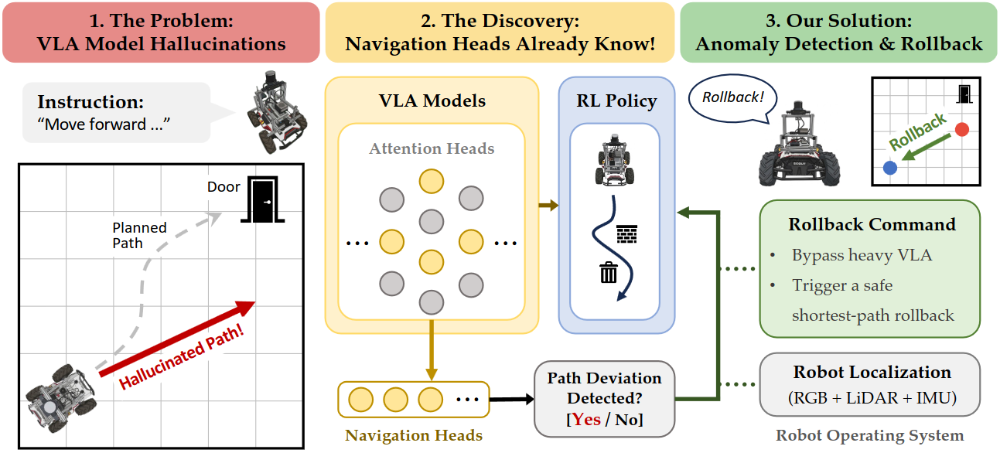
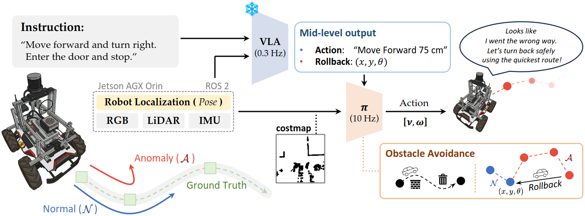
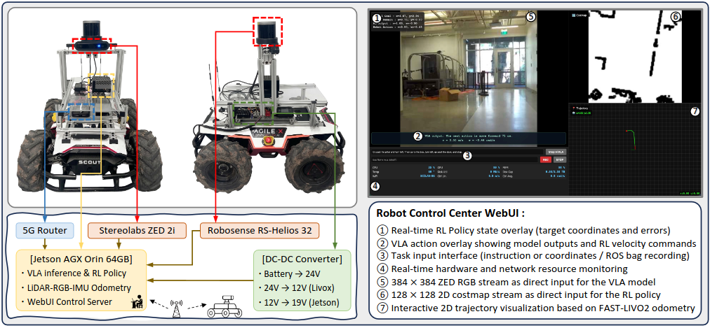

<p align="center">
  <h1 align="center"><strong>Your Vision-Language-Action Model Already Has Attention Heads For Path Deviation Detection</strong></h1>
</p>

<p align="center">
  <a href="https://jaehwan-j.github.io">Jaehwan Jeong</a><sup>1,2</sup>, Evelyn Zhu<sup>2</sup>, Jinying Lin<sup>2</sup>, Emmanuel Jaimes<sup>2</sup>,<br>
  <a href="https://tuananh1007.github.io">Tuan-Anh Vu</a><sup>2</sup>, Jungseock Joo<sup>2,3</sup>, Sangpil Kim<sup>1,†</sup>, and M. Khalid Jawed<sup>2,†</sup><br><br>
  <sup>1</sup>Korea University, &nbsp;
  <sup>2</sup>University of California, Los Angeles, &nbsp;
  <sup>3</sup>NVIDIA
</p>

<div align="center">
  <a href="https://arxiv.org/pdf/2603.13782">
    
  </a>
  <a href="https://jaehwan-j.github.io/projects/hivla/hivla.html">
    
  </a>
</div>

---

<p align="center">
  
</p>

## TL;DR

We propose an end-to-end robotic navigation framework that pairs a high-level VLA model with a continuous low-level RL policy. During normal operation, the RL policy constantly ensures reactive, collision-free obstacle avoidance, while highly accurate LiDAR-RGB-IMU sensor fusion (Fast-LIVO2) continuously logs safe waypoints. Simultaneously, by monitoring specialized internal attention heads, the system detects VLA hallucinations and path deviations in real-time with zero computational overhead. When a deviation occurs, the system seamlessly leverages the active RL policy to execute a direct safe recovery, autonomously navigating back to the last correct path for highly reliable real-world deployment. The entire pipeline is built on ROS 2, enabling modular integration and real-time operation on physical hardware.

---

## Overview

<p align="center">
  
</p>

HiVLA is a hierarchical navigation framework with two tightly integrated stages:

**Stage 1 — High-Level VLA Planner**
A frozen NaVILA model takes RGB observations and a language instruction to predict mid-level actions (e.g., *"Move forward 75 cm"*). Internally, a small subset of attention heads — termed **Navigation Heads (H_nav)** — naturally track spatiotemporal alignment between the visual history and the instruction. We monitor their entropy in real time to detect path deviations with near-zero additional computational overhead. Upon anomaly detection, the system saves the last safe checkpoint C_safe and triggers a rollback.

**Stage 2 — Low-Level RL Policy**
A lightweight CNN+MLP actor-critic (4.89 M params) trained in IsaacLab with PPO provides reactive, collision-free velocity commands using a 128×128 LiDAR costmap. It runs **continuously** alongside the VLA — handling local obstacle avoidance during normal navigation and executing the shortest-path recovery to C_safe when a deviation is detected.

---

## Repository Structure

```
HiVLA/
├── assets/                            # Figures for this README
├── Host/                              # Host PC (H_nav selection in VLA & RL policy training)
│   ├── HiVLA/
│   │   ├── HiVLA-NaVILA/              # Path deviation detection — NaVILA backbone
│   │   └── HiVLA-NaVid/               # Path deviation detection — NaVid backbone
│   └── IsaacLab/
│       └── source/extensions/
│           └── hivla_project/         # RL obstacle avoidance policy (PPO)
└── Jetson/                            # Jetson AGX Orin (real-world deployment)
    └── HiVLA/
        ├── ros2_ws/                   # ROS 2 workspace
        ├── third_party/               # NaVILA, Fast-LIVO2, Janus, Livox-SDK2, …
        └── ...
```

---

## Installation

### A. VLA Hyperparameter Search (Host PC)

After successfully installing [NaVILA](https://github.com/AnjieCheng/NaVILA) or [NaVid](https://github.com/jzhzhang/NaVid-VLN-CE), simply copy the corresponding directory into the model's root and run the provided shell script. See the linked README for the full step-by-step pipeline.

| Backbone | Copy | Run | Guide |
|----------|------|-----|-------|
| [NaVILA](https://github.com/AnjieCheng/NaVILA) | `cp -r Host/HiVLA/HiVLA-NaVILA/ /path/to/NaVILA/` | `bash eval_navila_hivla.sh` | [`HiVLA-NaVILA/README.md`](Host/HiVLA/HiVLA-NaVILA/README.md) |
| [NaVid](https://github.com/jzhzhang/NaVid-VLN-CE) | `cp -r Host/HiVLA/HiVLA-NaVid/ /path/to/NaVid-VLN-CE/` | `bash eval_navid_hivla.sh` | [`HiVLA-NaVid/README.md`](Host/HiVLA/HiVLA-NaVid/README.md) |

---

### B. RL Policy Training (Host PC — IsaacLab)

After successfully installing [Isaac Sim and Isaac Lab](https://isaac-sim.github.io/IsaacLab/), copy `Host/IsaacLab/` into your Isaac Lab root, install the extension, and run the training script.

```bash
./isaaclab.sh -p -m pip install -e source/extensions/hivla_project
```

See [`hivla_project/README.md`](Host/IsaacLab/source/extensions/hivla_project/README.md) for full training, evaluation, and checkpoint details.

---

### C. Jetson Deployment (Real-World)

<p align="center">
  
</p>

All experiments in the paper were conducted on the following hardware and software stack:

| Category | Component | Specification |
|----------|-----------|---------------|
| **Hardware** | Compute | NVIDIA Jetson AGX Orin Dev. 64 GB |
| | Mobile Base | AgileX Scout 2.0 |
| | Camera | ZED 2i (Stereo RGB-D) |
| | LiDAR | RoboSense Helios RS-32 |
| **System Software** | JetPack | 6.2.1 (L4T R36.4.7) |
| | Kernel | 5.15.148-tegra |
| | OS | Ubuntu 22.04 (aarch64) |
| | CUDA | 12.6 |
| | cuDNN | 9.3.0 |
| | Python | 3.10.12 |
| **ROS 2 Stack** | ROS 2 Distro | Humble |
| **NaVILA Model** | Base Model | VILA (LLaMA-3 8B) |
| | Vision Encoder | SigLIP-So400M/patch14/384 |
| | Checkpoint | navila-llama3-8b-8f |
| | Input Resolution | 384 × 384 |
| | Inference Frames | 8 (7 history + 1 current) |
| **Deviation Detection** | Selected Heads ([L, H]) | [21, 12], [16, 1], [14, 1] |
| | Window Size | W = 10 steps |
| | Patience Threshold | P = 9 steps |
| | Natural Threshold | τ = 0.95 |
| **RL Action Policy** | Architecture | CNN + MLP |
| | Parameters | 4.89 M |
| | Costmap Input | 1 × 128 × 128 (Occupancy Grid) |
| | Goal Input | 1 × 2 (Δx, Δy in local frame) |

See [`Jetson/HiVLA/README.md`](Jetson/HiVLA/README.md) for the full build and launch guide.

---

## Citation

```bibtex
@article{jeong2026your,
  title={Your Vision-Language-Action Model Already Has Attention Heads For Path Deviation Detection},
  author={Jeong, Jaehwan and Zhu, Evelyn and Lin, Jinying and Jaimes, Emmanuel and Vu, Tuan-Anh and Joo, Jungseock and Kim, Sangpil and Jawed, M Khalid},
  journal={arXiv preprint arXiv:2603.13782},
  year={2026}
}
```

---

## Acknowledgements

This work was supported by the USDA National Institute of Food and Agriculture (Grant No. 2024-67021-42528), the NVIDIA Academic Grants Program, the Korea Creative Content Agency via the Ministry of Culture, Sports and Tourism (No. RS-2024-00345025), and the Institute of Information & Communications Technology Planning & Evaluation (IITP) funded by the Korean government MSIT (No. RS-2019-II190079, Artificial Intelligence Graduate School Program, Korea University).
